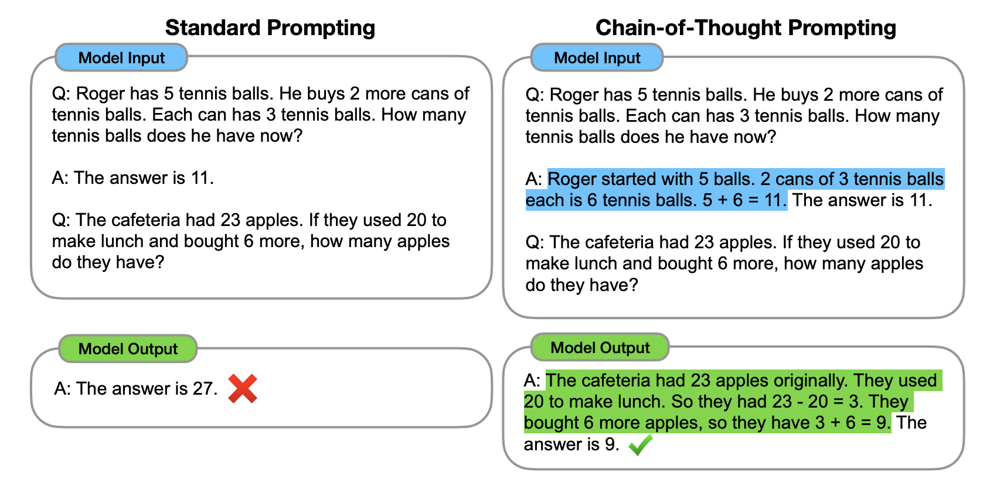
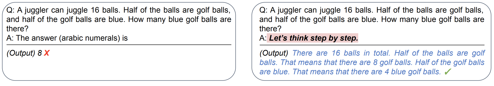
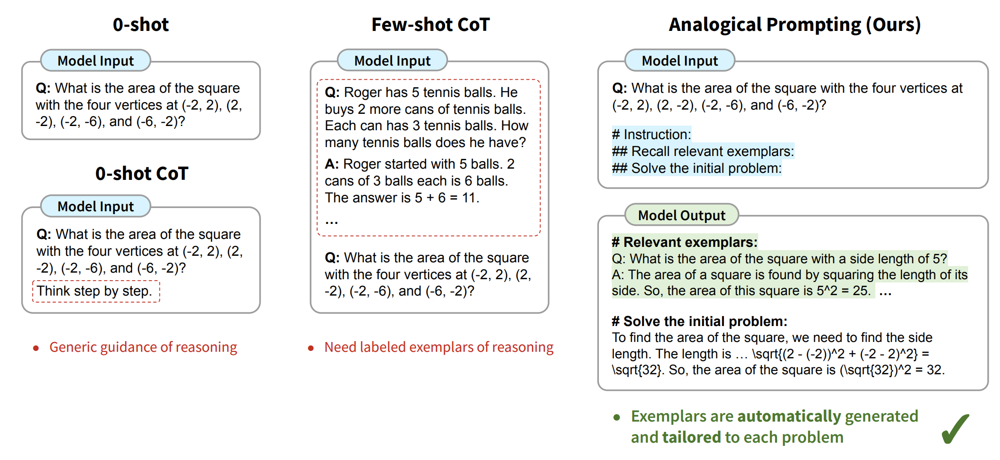
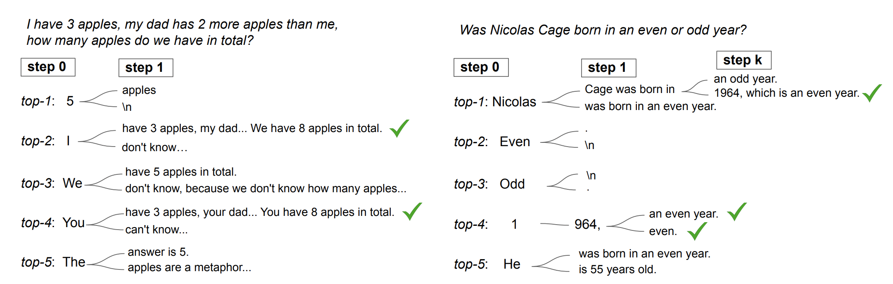

This blog is a summarization of the first lecture of the UC Berkeley LLM Agents course, taught by Dr. Denny Zhou, the founder and lead of the Reasoning team at Google DeepMind. In this lecture, Dr. Zhou explores various techniques and research efforts aimed at improving **Large Language Models (LLMs)** by integrating reasoning capabilities. While LLMs excel at pattern recognition and language generation, their ability to **logically reason and solve complex problems** remains limited. We dive into different strategies to understand how structured reasoning can enhance LLM performance across diverse tasks.

### Limitations of ML techniques

#### The Evolution of Automation

In the early days of human civilization, people handled all tasks manually. However, humans tend to get bored with repetitive work, which led to the idea of **automation**. If a problem can be solved by following a specific sequence of fixed steps (an **algorithm**), we can automate the process. This is known as the **rule-based approach**.

##### Example: Making Tea

For instance, making tea follows a well-defined set of steps. Once you determine these steps, executing them in the same order will always yield the same result. Moreover, these steps can also be carried out by a machine.

In this scenario, as a developer, you are essentially creating **"rules"** that can be followed by anyone—even a machine—to achieve the desired outcome.

---

#### The Complexity of Real-World Problems

Now, consider a more complex problem, like **predicting the price of a property in New Delhi**. You could attempt a rule-based approach, such as:

> *"If it's a 3 BHK, the price is 1.2 Cr."*

But property pricing depends on numerous factors:

- Proximity to the airport or market  
- Whether it’s near a water body  
- Crime rates in the area  
- Local demand and supply dynamics  

Defining all these variables as fixed rules is extremely challenging. Instead of manually crafting these rules, **we let the machine learn them on its own**.

---

#### What Does It Mean to "Let the Machine Learn the Rules"?  

Some algorithms, when provided with **data** and **corresponding target values**, can recognize **patterns** and **relationships** between inputs and outputs. A simple example of such a relationship can be represented as:
$$
House Price  = \beta_1 * airport\_distance + \beta_2 * crime\_rate + \beta_3 * is\_flood\_zone + \beta_0
$$

This is a simple linear equation that can be solved if we have enough real-world data points.

### Why Can't Machines Learn Like Humans?

#### A Simple Toy Problem

Let's begin with a basic problem to illustrate the challenge. Extract the last letter of each word and concatenate them.

| Input        | Output |
|--------------|---------|
| Sumit Tyagi  | ti  |
| Bill Gates   | ls  |
| Barack Obama | ?   |

To solve this using a Transformer model, you’d need **vast amounts of training data**—yet it might only achieve around 80% accuracy.

Would you still call ML "Intelligent" if it requires enormous data for a task that's trivial for humans?

For **ML to truly mimic human intelligence**, it should be able to learn from just a few examples—just like we do. However, **ML struggles with this**.

Why can humans grasp concepts so quickly while ML needs massive amounts of data?

#### The Answer: **Reasoning!**

Humans don’t just memorize patterns; we **reason, generalize, and infer** based on our experiences. This allows us to learn efficiently from minimal examples.

# Reasoning! 🧠

Let's see how Large Language Models (LLMs) handle this problem. LLMs are built on the Transformer architecture and are trained to predict the next word. These models have already been trained on vast datasets—essentially, all the text available on the internet.  

Think of training LLMs as **teaching a parrot to mimic human language**. Now, instead of retraining the model from scratch, we can guide it using examples before asking a question.  

This technique is known as **Few-shot Prompting** [arXiv:2005.14165 [cs.CL]](https://arxiv.org/abs/2005.14165).  

## Few-shot Prompting

Input:

```plaintext
Q: "Elon Musk"
A: "nk"

Q: "Bill Gates"
A: "ls"

Q: "Barack Obama"
A:
```

Output:

```plaintext
"ca"
```

As seen above, the output is still incorrect. Instead of actual reasoning, the model is just using the provided examples to generate a response—without truly understanding the pattern.

### How to fix this?

Let’s try to introduce a reasoning process before generating the answer.

## Adding Reasoning Process

Input:

```plaintext
Q: "Elon Musk"
A: the last letter of "Elon" is "n". the last letter of "Musk" is "k". concatenating "n", "k" leads to "nk". so the output is "nk"

Q: "Barack Obama"
A: 
```

Output:

```plaintext
"ka"
```

The reasoning:

> the last letter of "Elon" is "n". the last letter of "Musk" is "k". concatenating "n", "k" leads to "nk".

This worked well with just one example!

The idea of adding intermediate steps has been proposed by different researchers throughout time.

- Program Induction by Rationale Generation: Learning to Solve and Explain Algebraic Word Problems [arXiv:1705.04146 [cs.AI]](https://arxiv.org/abs/1705.04146)
- GSM8K - Training Verifiers to Solve Math Word Problems. OpenAI built a much larger math word problem dataset [arXiv:2110.14168 [cs.LG]](https://arxiv.org/abs/2110.14168)
- Show Your Work: Scratchpads for Intermediate Computation with Language Models [arXiv:2112.00114 [cs.LG]](https://arxiv.org/abs/2112.00114)

They discovered similar ideas independently in different domains. But the basic idea is the same.

## Chain-of-Thought Prompting

Some researchers explored how generating a chain of thought, i.e., a series of intermediate reasoning steps, significantly improves the ability of LLM models to perform complex reasoning. Though it's not a technical term, this prompting strategy is widely known as **Chain of Thought** [arXiv:2201.11903 [cs.CL]](https://arxiv.org/abs/2201.11903) prompting.

The following figure shows the model is able to solve problems accurately if we provide the intermediate reasoning:



Chain-of-Thought Prompting significantly outperformed Standard Prompting on each benchmark with similar results for all models.

Going back to all the research:

- [arXiv:1705.04146 [cs.AI]](https://arxiv.org/abs/1705.04146) Training with intermediate steps.
- [arXiv:2110.14168 [cs.LG]](https://arxiv.org/abs/2110.14168) Finetuning with intermediate steps.
- [arXiv:2112.00114 [cs.LG]](https://arxiv.org/abs/2112.00114) Prompting with the intermediate steps.

You might wonder, OK! "What part is more important?"
Actually, it doesn't matter if you train, fine-tune, or prompt the model. What really matters here is intermediate steps!

Regardless of training, fine-tuning, or prompting, when provided with examples that include intermediate steps, LLMs will generate responses that also include intermediate steps.

Great so far!

> But, in addition to intermediate steps, is it helpful to introduce reasoning strategies in demonstration examples?

Similar to humans, when we encounter a problem, we have some learned strategies that we try to apply.

One common strategy is to decompose the problem into smaller manageable parts.

## Least-to-Most Prompting

Let's take a problem:

```plaintext
Elsa has 3 apples. Anna has 2 more apples than Elsa. How many apples do they have together?
```

By decomposition:

```plaintext
Let's break down this problem: 
1. How many apples does Anna have?
2. How many apples do Elsa and Anna have together?
```

Answer:

```plaintext
1. Anna has 2 more apples than Elsa. So Anna has 2 + 3 = 5 apples.
2. Anna has 5 apples. Elsa and Anna have 3 + 5 = 8 apples together.
The answer is 8.
```

Chain-of-thought prompting has shown impressive results across various natural language reasoning tasks. However, its performance declines when tackling problems that are more complex than the examples provided in the prompts. To address this **easy-to-hard generalization challenge**, researchers introduced a new prompting strategy **Least-to-Most Prompting** [arXiv:2205.10625 [cs.AI]](https://arxiv.org/abs/2205.10625).

Using least-to-most prompting techniques, we can increase the model's ability to understand new combinations of familiar concepts, this is called compositional generalization.

Why do we need intermediate steps? Because:

- Transformers generating intermediate steps can solve any inherently serial problem as long as its depth exceeds a constant threshold.
- Transformers generating direct answers either require a huge depth to solve or cannot solve at all.

## What to do next?

So in case you feel LLM is failing to solve a problem, then you can:

- Think of generating more intermediate steps.
- Or you can call for help (call external tools).
- Diagnose the failure.

> Is it possible to trigger step-by-step reasoning without using demonstration examples?

## Yes! Large Language Models are Zero-Shot Reasoners

A research paper [arXiv:2205.11916 [cs.CL]](https://arxiv.org/abs/2205.11916) from Takeshi Kojima did an excellent discovery that LLMs are decent zero-shot reasoners by simply adding **"Let's think step by step"** before each answer.

They said:
> Experimental results demonstrate that our Zero-shot-CoT, using the same single prompt template, significantly outperforms zero-shot LLM performances on diverse benchmark reasoning tasks including arithmetics (MultiArith, GSM8K, AQUA-RAT, SVAMP), symbolic reasoning (Last Letter, Coin Flip), and other logical reasoning tasks (Date Understanding, Tracking Shuffled Objects), without any hand-crafted few-shot examples.

The following snippet from the same paper demonstrates how we can incite reasoning capabilities just by mentioning "Let's think step by step":



> Zero-shot is cool but usually significantly worse than few-shot.

Any technique that's still zero-shot but can do much better work?

## Yes! LLMs are Analogical Reasoners

"**Do you know a related problem?** We can likely imagine a problem absolutely new, unlike and unrelated to any formerly solved problem, but if such a problem could exist, it would be insoluble" - _How to Solve It, G. POLYA_

### Analogical Prompting

A research paper by Michihiro Yasunaga [arXiv:2310.01714 [cs.LG]](https://arxiv.org/abs/2310.01714) tried to eliminate the need of adding examples or knowledge in context by adding **Recall a related problem, and then solve this one**. The work is inspired by analogical reasoning, a cognitive process in which humans draw from relevant past experiences to tackle new problems. Our approach prompts language models to self-generate relevant exemplars or knowledge in the context before proceeding to solve the given problem.

Below is the snippet from the paper comparing analogical reasoning with other methods.



> Is there a way to induce step-by-step reasoning even without using any specific prompt like "Think step-by-step"?

## Chain-of-Thought Reasoning without Prompting

[arXiv:2402.10200 [cs.CL]](https://arxiv.org/abs/2402.10200)
The idea is that LLMs are trained on data that already has a lot of step-by-step examples. CoT reasoning paths can be elicited from pre-trained LLMs by simply altering the decoding process. In this approach, we decode at step 0, start from the top-5 tokens, and then do greedy decoding.

The following figure shows decoded paths by considering alternative tokens.



We can further improve it by adding self-consistency [arXiv:2203.11171 [cs.CL]](https://arxiv.org/abs/2203.11171). It first samples a diverse set of reasoning paths instead of only taking the greedy one, and then selects the most consistent answer by marginalizing out the sampled reasoning paths.

## Conclusion

In this blog, we explored the limitations of traditional machine learning techniques and the importance of reasoning in enhancing the capabilities of Large Language Models (LLMs). We discussed various prompting strategies such as Few-shot Prompting, Chain-of-Thought Prompting, Least-to-Most Prompting, and Analogical Prompting, which have shown significant improvements in LLM performance on complex reasoning tasks. Additionally, we highlighted the potential of LLMs as zero-shot reasoners and the innovative approach of inducing reasoning without explicit prompts. By incorporating intermediate steps and reasoning strategies, we can unlock the true potential of LLMs, making them more intelligent and capable of solving a wide range of problems efficiently.

Thank you for reading, and stay tuned for more insights into the fascinating world of LLMs and AI research!
